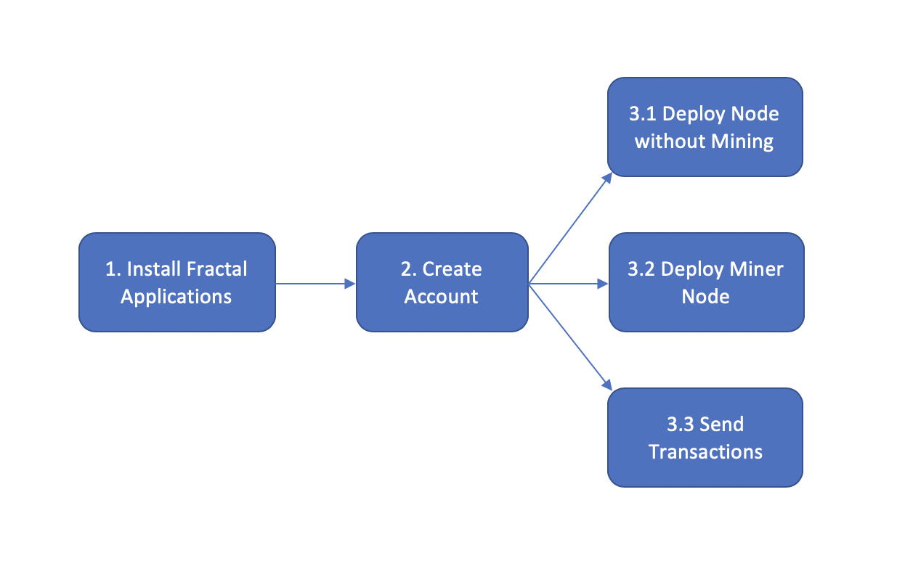

Getting Started
=================
In this tutorial, you will learn how to:

- Install Fractal Applications on macOS and Linux(Centos,Ubuntu,Amazon)
- Create your account
- Deploy non-miner node on Fractal Testnet
- Deploy miner node on Fractal Testnet
- Send transactions on Fractal Testnet

Install Fractal Applications
------------------------------------------
Prerequisite
^^^^^^^^^^^^^^^^^^
Supported Operation Systems:

    * macOS(version: 10.14.6 or later)
    * CentOS Linux(version: 7.6.1810 or later)
    * Ubuntu Linux(version: 18.04.2 or later)
    * Amazon Linux 2

Hardware Minimum Requirements:

    * 2 vCPUs/cores
    * 4GB RAM
    * 100GB Disk
    * 10Mbps Network bandwidth

Install Steps
^^^^^^^^^^^^^^^^^^
1. Start the terminal application.
2. Fetch install script, and run it in terminal:

.. code-block:: console

    $ curl -O https://raw.githubusercontent.com/fractal-platform/fractal/master/scripts/install.sh
    $ bash install.sh
    VERSION:
        0.2.0-stable-1328975
        Install fractal success.

If you get VERSION in terminal, it means that your installation is successful.

Create your account
------------------------------------------
You can create account in two ways:

* Use gtool command line. Run these commands in terminal:

.. note:: Assume your password is `123456`.

.. code-block:: console

    $ cd ~/fractal-test
    $ gtool keys --keys data/keys --pass 123456 newkeys
    New Account Key Address: 0xb22739bbea639879341cb299eb434da6034b4a93
    New Mining Key Address: 0xb22739bbea639879341cb299eb434da6034b4a93
    New Mining Public Key: 0x1f9b16b1e48a7677b0e31a698db8e984fb84e17a7177c5f183598c631fdc18651c422a68f52c056ec3bbe82b969782878dc2454b8b5dd3e35c3d67a9955f0a5b82ac7e4a857268334dcb16e379741f4d92073801a259849dfe482bec2eb9f94c62dc19e8aa202087257148d4416956fbdad01aed540a6b6336ec0c6124111609
    New Packer Key Address: 0xb22739bbea639879341cb299eb434da6034b4a93
    New Packer Public Key: 0x04d3d97a0985c8321fcd56cf43182fc36dece5565e6088f61edf2358c9bdb4068b58c724edf4a1063662fc2bf0f45001673d913de5475d62418e682c2f0f2c5dc5

Then you can get your <New Account Key Address> from terminal output.

.. hint::
    | **Parameter `--pass [password]`** is used to protect your private keys.
    | Visit `here <../refs/gtool.html>`_ for more information about gtool command line tool.

You can export your private key, so it can be later imported into Wallet Application. Run these commands in terminal:

.. code-block:: console

    $ cd ~/fractal-test
    $ gtool keys --keys data/keys --pass 123456 export
    Account Address: 0xb22739bbea639879341cb299eb434da6034b4a93
    Account Private Key: 0x658f7e50dfba35e86daae1a3ce2d14f8bbaffe02169936a3a597548ca98d5099

Then you can get your <Account Private Key> from terminal output.

* Use Fractal Wallet Application

Visit https://github.com/fractal-platform/pihsiu for more information about fractal wallet.

How to Raise Stake on Fractal Testnet
^^^^^^^^^^^^^^^^^^^^^^^^^^^^^^^^^^^^^^^^^
You can obtain stake in two ways:

* Request stake from the website: http://token.fractalblock.com:8081.
* Ask your friend to transfer stake to you.

How to Check Your Stake on Fractal Testnet
^^^^^^^^^^^^^^^^^^^^^^^^^^^^^^^^^^^^^^^^^^^^^^^^^^^^^^^^^
You can check your stake in two ways:

* Find account details in the website: http://testnet.fractalblock.com:8081.

* Use gtool command line. Run these commands in terminal:

.. code-block:: console

    $ cd ~/fractal-test
    $ gtool state --rpc http://52.82.13.37:8545 --addr 0x7c925f73bf47ec7815d2444a9a2e4ae5afe66638 account
    get head block ok height=5727 round=15680153439 hash=0x357de7255e306ea4677eee775e2d0b398281325b7945cc8f4955b8d7fc3cfa0a
    get balance ok addr=0x7C925f73bF47EC7815d2444A9a2E4aE5aFE66638 balance=9999981039077

Then you can get your account balance in terminal output.

.. hint::
    | **Parameter `--rpc [rpc address]`** should be set to RPC server address on Fractal Testnet, `http://52.82.13.37:8545` is one of Fractal Testnet Node, and here is the `rpc address list <../refs/rpclist.html>`_.
    | **Parameter `--addr [account address]`** is the account address produced when you create your account.
    | Visit `here <../refs/gtool.html>`_ for more information about gtool command line tool.

Deploy non-miner node
------------------------------------------
.. note::
    If you have already started gftl program, you must use Ctrl+C to interrupt it first.

Run these commands in terminal:

.. code-block:: console

    $ cd ~/fractal-test
    $ gftl --testnet --rpc --datadir data --unlock 123456
    2019-09-09 15:59:16.748632 +0800 CST m=+0.052548987 Init blockchain OK(genesis=0xae1973d51c2a66db2fc0926e7a8c1c3fd9bdf075580f6dcf72b44e949e2d02e7, head=0xae1973d51c2a66db2fc0926e7a8c1c3fd9bdf075580f6dcf72b44e949e2d02e7)
    2019-09-09 15:59:19.131155 +0800 CST m=+2.435093105 Fractal peer connected(id=469ccf0312f3dd24)
    2019-09-09 15:59:19.147721 +0800 CST m=+2.451659406 Fractal peer connected(id=5b736302b16b83e5)
    2019-09-09 15:59:19.408645 +0800 CST m=+2.712586471 Fractal peer connected(id=5c54835293b80fa3)
    2019-09-09 15:59:19.520132 +0800 CST m=+2.824074272 Fractal peer connected(id=1c41121cfd30350d)
    2019-09-09 15:59:19.551452 +0800 CST m=+2.855394536 Fractal peer connected(id=0cbd58dbd9e648e3)
    2019-09-09 15:59:19.568151 +0800 CST m=+2.872093786 Fractal peer connected(id=827aaab540c6b45b)
    2019-09-09 15:59:19.725936 +0800 CST m=+3.029879455 Fractal peer connected(id=cabac16236e60a2f)
    2019-09-09 15:59:19.794875 +0800 CST m=+3.098819668 Fractal peer connected(id=0af505051a3b3ab2)
    2019-09-09 15:59:20.176336 +0800 CST m=+3.480284129 Insert block OK(height=5761, round=15680156879, hash=0x35d250db8435ee20139b9fefcfe295640b06f1f5d308be7831aee3943d78998f)
    2019-09-09 15:59:20.176533 +0800 CST m=+3.480481033 Insert block OK(height=5760, round=15680156695, hash=0x9329092d5f767f09c0afcd94120a39caf0c7b77b95e637e577deec300f118f34)
    2019-09-09 15:59:20.176704 +0800 CST m=+3.480651646 Insert block OK(height=5759, round=15680156453, hash=0x901d2ea0022eaa3c539eb19f6f90a1cc19be06920a9f4c6fe5d1f6c263a77e9d)
    2019-09-09 15:59:20.176844 +0800 CST m=+3.480791871 Insert block OK(height=5758, round=15680156386, hash=0x1e77be7991a13f1dbd0899d9f6ad2ce8216f4d4f1b17c9bca7b7646e37a22908)
    2019-09-09 15:59:20.176952 +0800 CST m=+3.480900014 Insert block OK(height=5757, round=15680156278, hash=0x01d71b978ebc802e497c1ae43394b7356196193321c8515c45024ddb1dd91e65)
    2019-09-09 15:59:20.177193 +0800 CST m=+3.481141211 Insert block OK(height=5756, round=15680156271, hash=0xa995400d47754d8f6712b32b64d09f3232b7a458f2053d32ed8e3d874e702f55)

.. hint::
    | **Parameter `--unlock [password]`** is the password when you create your account.
    | Visit `here <../refs/gtool.html>`_ for more information about gtool command line tool.

Start another terminal to check status. Run these commands in terminal:

.. code-block:: console

    $ cd ~/fractal-test
    $ gtool block --rpc http://127.0.0.1:8545 --height 0 query
    t=2019-09-09T16:07:35.526+0800 lvl=info msg="get block ok" block="&{Header:{ParentHash:[0 0 0 0 0 0 0 0 0 0 0 0 0 0 0 0 0 0 0 0 0 0 0 0 0 0 0 0 0 0 0 0] Round:15679008000 Sig:[] Coinbase:[0 0 0 0 0 0 0 0 0 0 0 0 0 0 0 0 0 0 0 0] Difficulty:+10000000000000000000 Height:0 Amount:1 GasLimit:20000000000 GasUsed:0 StateHash:[22 107 197 80 180 65 1 40 11 208 142 92 217 244 59 106 167 196 9 115 102 73 54 32 65 140 28 67 65 153 226 116] TxHash:[0 0 0 0 0 0 0 0 0 0 0 0 0 0 0 0 0 0 0 0 0 0 0 0 0 0 0 0 0 0 0 0] ReceiptHash:[0 0 0 0 0 0 0 0 0 0 0 0 0 0 0 0 0 0 0 0 0 0 0 0 0 0 0 0 0 0 0 0] ParentFullHash:[0 0 0 0 0 0 0 0 0 0 0 0 0 0 0 0 0 0 0 0 0 0 0 0 0 0 0 0 0 0 0 0] Confirms:[] FullSig:[] MinedTime:0 HopCount:0} Body:{Transactions:[] TxPackageHashes:[]} simpleHash:{v:<nil>} fullHash:{v:<nil>} bloom:{v:<nil>} StateChecked:0 ReceivedAt:0001-01-01 00:00:00 +0000 UTC ReceivedFrom:<nil> ReceivedPath:0}"

Then you can get the genesis block detail in terminal output.

.. hint::
    | **Parameter `--rpc [rpc address]`** should be set to RPC server address on Fractal Testnet, `http://127.0.0.1:8545` is your local node address, and here is the `rpc address list <../refs/rpclist.html>`_.
    | Visit `here <../refs/gtool.html>`_ for more information about gtool command line tool.

Deploy miner node
------------------------------------------
.. note::
    If you have already started gftl program, you must use Ctrl+C to interrupt it first.

1. First, you must check your account stake balance. Since Fractal is proof-of-stake, you must hold some stakes to start mining.
2. Register mining keys. Run these commands in terminal:

.. code-block:: console

    $ cd ~/fractal-test
    $ gtool keys --rpc http://52.82.13.37:8545 --keys data/keys --pass 123456 --chainid 2 regminingkey
    t=2019-09-09T16:12:19.871+0800 lvl=info msg="get nonce ok" nonce=1
    t=2019-09-09T16:12:19.871+0800 lvl=info msg="action slice" data=0x000000007805b3c2800161784b536608fd21d4341fb6746d8b083b62a03fadc50e1701b10ccda487089c6594340dba9c67e88dbefd36996e0ed0d7470b3beb5f2033261eaa731dbd0d143968e94d944b3dc81fcf4f7cecfd7c0ec7e81c2404a827e53d284c6212dce1677ac3639bd0006ca8ecf74314806ca4ee3a657bd5662073b52c877c7501e12ffc
    t=2019-09-09T16:12:21.961+0800 lvl=info msg="recv tx rsp" from=0x7C925f73bF47EC7815d2444A9a2E4aE5aFE66638 nonce=1 hash=0xb2cbed241d6dc5282daf32eff2975156a89e510a4746abf4ccaf1f40506581b9 to=0x0000000000000000000000000000000000000001 receipt=<nil>
    t=2019-09-09T16:12:24.184+0800 lvl=info msg="recv tx rsp" from=0x7C925f73bF47EC7815d2444A9a2E4aE5aFE66638 nonce=1 hash=0xb2cbed241d6dc5282daf32eff2975156a89e510a4746abf4ccaf1f40506581b9 to=0x0000000000000000000000000000000000000001 receipt="&{PostState:[] Status:1 CumulativeGasUsed:2872960923 Bloom:[0 0 0 0 0 0 0 0 0 0 0 0 0 0 0 0 0 0 0 0 0 0 0 0 0 0 0 0 0 0 0 0 0 0 0 0 0 0 0 0 0 0 0 0 0 0 0 0 0 0 0 0 0 0 0 0 0 0 0 0 0 0 0 0 0 0 0 0 0 0 0 0 0 0 0 0 0 0 0 0 0 0 0 0 0 0 0 0 0 0 0 0 0 0 0 0 0 0 0 0 0 0 0 0 0 0 0 0 0 0 0 0 0 0 0 0 0 0 0 0 0 0 0 0 0 0 0 0 0 0 0 0 0 0 0 0 0 0 0 0 0 0 0 0 0 0 0 0 0 0 0 0 0 0 0 0 0 0 0 0 0 0 0 0 0 0 0 0 0 0 0 0 0 0 0 0 0 0 0 0 0 0 0 0 0 0 0 0 0 0 0 0 0 0 0 0 0 0 0 0 0 0 0 0 0 0 0 0 0 0 0 0 0 0 0 0 0 0 0 0 0 0 0 0 0 0 0 0 0 0 0 0 0 0 0 0 0 0 0 0 0 0 0 0 0 0 0 0 0 0 0 0 0 0 0 0 0 0 0 0 0 0 0 0 0 0 0 0 0 0 0 0 0 0 0 0 0 0 0 0 0 0 0 0 0 0 0 0 0 0 0 0 0 0 0 0 0 0 0 0 0 0 0 0 0 0 0 0 0 0 0 0 0 0 0 0 0 0 0 0 0 0 0 0 0 0 0 0 0 0 0 0 0 0 0 0 0 0 0 0 0 0 0 0 0 0 0 0 0 0 0 0 0 0 0 0 0 0 0 0 0 0 0 0 0 0 0 0 0 0 0 0 0 0 0 0 0 0 0 0 0 0 0 0 0 0 0 0 0 0 0 0 0 0 0 0 0 0 0 0 0 0 0 0 0 0 0 0 0 0 0 0 0 0 0 0 0 0 0 0 0 0 0 0 0 0 0 0 0 0 0 0 0 0 0 0 0 0 0 0 0 0 0 0 0 0 0 0 0 0 0 0 0 0 0 0 0 0 0 0 0 0 0 0 0 0 0 0 0 0 0 0 0 0 0 0 0 0 0 0 0 0 0 0 0 0 0 0 0 0 0 0 0 0 0 0 0 0 0 0 0 0 0 0 0 0 0 0 0 0 0 0 0 0 0 0 0 0 0 0 0 0 0 0 0 0 0 0 0 0 0 0 0 0 0 0 0 0 0 0 0 0 0 0 0 0 0 0 0 0 0 0 0 0 0 0 0 0 0 0 0 0 0 0 0 0 0 0 0 0 0 0 0 0 0 0 0 0 0 0 0 0 0 0 0 0 0 0 0 0 0 0 0 0 0 0 0 0 0 0 0 0 0 0 0 0 0 0 0 0 0 0 0 0 0 0 0 0 0 0 0 0 0 0 0 0 0 0 0 0 0 0 0 0 0 0 0 0 0 0 0 0 0 0 0 0 0 0 0 0 0 0 0 0 0 0 0 0 0 0 0 0 0 0 0 0 0 0 0 0 0 0 0 0 0 0 0 0 0 0 0 0 0 0 0 0 0 0 0 0 0 0 0 0 0 0 0 0 0 0 0 0 0 0 0 0 0 0 0 0 0 0 0 0 0 0 0 0 0 0 0 0 0 0 0 0 0 0 0 0 0 0 0 0 0 0 0 0 0 0 0 0 0 0 0 0 0 0 0 0 0 0 0 0 0 0 0 0 0 0 0 0 0 0 0 0 0 0 0 0 0 0 0 0 0 0 0 0 0 0 0 0 0 0 0 0 0 0 0 0 0 0 0 0 0 0 0 0 0 0 0 0 0 0 0 0 0 0 0 0 0 0 0 0 0 0 0 0 0 0 0 0 0 0 0 0 0 0 0 0 0 0 0 0 0 0 0 0 0 0 0 0 0 0 0 0 0 0 0 0 0 0 0 0 0 0 0 0 0 0 0 0 0 0 0 0 0 0 0 0 0 0 0 0 0 0 0 0 0 0 0 0 0 0 0 0 0 0 0 0 0 0 0 0 0 0 0 0 0 0 0 0 0 0 0 0 0 0 0 0 0 0 0 0 0 0 0 0 0 0 0 0 0 0 0 0 0 0 0 0 0 0 0 0 0 0 0 0 0 0 0 0 0 0 0 0 0 0 0 0 0 0 0 0 0 0 0 0 0 0 0 0 0 0 0 0 0 0 0 0 0 0 0 0 0 0 0 0 0 0 0 0 0 0 0 0 0 0 0 0 0 0 0 0 0 0 0 0 0 0 0 0 0 0 0 0 0 0 0 0 0 0 0 0 0 0 0 0 0 0 0 0 0 0 0 0 0 0 0 0 0 0 0 0 0 0 0 0 0 0 0 0 0 0 0 0 0 0 0 0 0 0 0 0 0 0 0 0 0 0 0 0 0 0 0 0 0 0 0 0 0 0 0 0 0 0 0 0 0 0 0 0 0 0 0 0 0 0 0 0 0 0 0 0 0 0 0 0 0 0 0 0 0 0 0 0 0 0 0 0 0 0 0 0 0 0 0 0 0 0 0 0 0 0 0 0 0 0 0 0 0 0 0 0 0 0 0 0 0 0 0 0 0 0 0 0 0 0 0 0 0 0 0 0 0 0 0 0 0 0 0 0 0 0 0 0 0 0 0 0 0 0 0 0 0 0 0 0 0 0 0 0 0 0 0 0 0 0 0 0 0 0 0 0 0 0 0 0 0 0 0 0 0 0 0 0 0 0 0 0 0 0 0 0 0 0 0 0 0 0 0 0 0 0 0 0 0 0 0 0 0 0 0 0 0 0 0 0 0 0 0 0 0 0 0 0 0 0 0 0 0 0 0 0 0 0 0 0 0 0 0 0 0 0 0 0 0 0 0 0 0 0 0 0 0 0 0 0 0 0 0 0 0 0 0 0 0 0 0 0 0 0 0 0 0 0 0 0 0 0 0 0 0 0 0 0 0 0 0 0 0 0 0 0 0 0 0 0 0 0 0 0 0 0 0 0 0 0 0 0 0 0 0 0 0 0 0 0 0 0 0 0 0 0 0 0 0 0 0 0 0 0 0 0 0 0 0 0 0 0 0 0 0 0 0 0 0 0 0 0 0 0 0 0 0 0 0 0 0 0 0 0 0 0 0 0 0 0 0 0 0 0 0 0 0 0 0 0 0 0 0 0 0 0 0 0 0 0 0 0 0 0 0 0 0 0 0 0 0 0 0 0 0 0 0 0 0 0 0 0 0 0 0 0 0 0 0 0 0 0 0 0 0 0 0 0 0 0 0 0 0 0 0 0 0 0 0 0 0 0 0 0 0 0 0 0 0 0 0 0 0 0 0 0 0 0 0 0 0 0 0 0 0 0 0 0 0 0 0 0 0 0 0 0 0 0 0 0 0 0 0 0 0 0 0 0 0 0 0 0 0 0 0 0 0 0 0 0 0 0 0 0 0 0 0 0 0 0 0 0 0 0 0 0 0 0 0 0 0 0 0 0 0 0 0 0 0 0 0 0 0 0 0 0 0 0 0 0 0 0 0 0 0 0 0 0 0 0 0 0 0 0 0 0 0 0 0 0 0 0 0 0 0 0 0 0 0 0 0 0 0 0 0 0 0 0 0 0 0 0 0 0 0 0 0 0 0 0 0 0 0 0 0 0 0 0 0 0 0 0 0 0 0 0 0 0 0 0 0 0 0 0 0 0 0 0 0 0 0 0 0 0 0 0 0 0 0 0 0 0 0 0 0 0 0 0 0 0 0 0 0 0 0 0 0 0 0 0 0 0 0 0 0 0 0 0 0 0 0 0 0 0 0 0 0 0 0 0 0 0 0 0 0 0 0 0 0 0 0 0 0 0 0 0 0 0 0 0 0 0 0 0 0 0 0 0 0 0 0 0 0 0 0 0 0 0 0 0 0 0 0 0 0 0 0 0 0 0 0 0 0 0 0 0 0 0 0 0 0 0 0 0 0 0 0 0 0 0 0 0 0 0 0 0 0 0 0 0 0 0 0 0 0 0 0 0 0 0 0 0 0 0 0 0 0 0 0 0 0 0 0 0 0 0 0 0 0 0 0 0 0 0 0 0 0 0 0 0 0 0 0 0 0 0 0 0 0 0 0 0 0 0 0 0 0 0 0 0 0 0 0 0 0 0 0 0 0 0 0 0 0 0 0 0 0 0 0 0 0 0 0 0 0 0 0 0 0 0 0 0 0 0 0 0 0 0 0 0 0 0 0 0 0 0 0 0 0 0 0 0 0 0 0 0 0 0 0 0 0 0 0 0 0 0 0 0 0 0 0 0 0 0 0 0 0 0 0 0 0 0 0 0 0 0 0 0 0 0 0 0 0 0 0 0 0 0 0 0 0 0 0 0 0 0 0 0 0 0 0 0 0 0 0 0 0 0 0 0 0 0 0 0 0 0 0 0 0 0 0 0 0 0 0 0 0 0 0 0 0 0 0 0 0 0 0 0 0 0 0 0 0 0 0 0 0 0 0 0 0 0 0 0 0 0 0 0 0 0 0 0 0 0 0 0 0 0 0 0 0 0 0 0 0 0 0 0 0 0 0 0 0 0 0 0 0 0 0 0 0 0 0 0 0 0 0 0 0 0 0 0 0 0 0 0 0 0 0 0 0 0 0 0 0 0 0 0 0 0 0 0 0 0 0 0 0 0 0 0 0 0 0 0 0 0 0 0 0 0 0 0 0 0 0 0 0 0 0 0 0 0 0 0 0 0 0 0 0 0 0 0 0 0 0 0 0 0 0 0 0 0 0 0 0 0 0 0 0 0 0 0 0 0 0 0 0 0 0 0 0 0 0 0 0 0 0 0 0 0 0 0 0 0 0 0 0 0 0 0 0 0 0 0 0 0 0 0 0 0 0 0 0 0 0 0 0 0 0 0 0 0 0 0 0 0 0 0 0 0 0 0 0 0 0 0 0 0 0 0 0 0 0 0 0 0 0 0 0 0 0 0 0 0 0 0 0 0 0 0 0 0 0 0 0 0 0 0 0 0 0 0 0 0 0 0 0 0 0 0 0 0 0 0 0 0 0 0 0 0 0 0 0 0 0 0 0 0 0 0 0 0 0 0 0 0 0 0 0 0 0 0 0 0 0 0 0 0 0 0 0 0 0 0 0 0 0 0 0 0 0 0 0 0 0 0 0 0 0 0 0 0 0 0 0 0 0 0 0 0 0 0 0 0 0 0 0 0 0 0 0 0 0 0 0 0 0 0 0 0 0 0 0 0 0 0 0 0 0 0 0 0 0 0 0 0 0 0 0 0 0 0 0 0 0 0 0 0 0 0 0 0 0 0 0 0 0 0 0 0 0 0 0 0 0 0 0 0 0 0 0 0 0 0 0 0 0 0 0 0 0 0 0 0 0 0 0 0 0 0 0 0 0 0 0 0 0 0 0 0 0 0 0 0 0 0 0 0 0 0 0 0 0 0 0 0 0 0 0 0 0 0 0 0 0 0 0 0 0 0 0 0 0 0 0 0 0 0 0 0 0 0 0 0 0 0 0 0 0 0 0 0 0 0 0 0 0 0 0 0 0 0 0 0 0 0 0 0 0 0 0 0 0 0 0 0 0 0 0 0 0 0 0 0 0 0 0 0 0 0 0 0 0 0 0 0 0 0 0 0 0 0 0 0 0 0 0 0 0 0 0 0 0 0 0 0 0 0 0 0 0 0 0 0 0 0 0 0 0 0 0 0 0 0 0 0 0 0 0 0 0 0 0 0 0 0 0 0 0 0 0 0 0 0 0 0 0 0 0 0 0 0 0 0 0 0 0 0 0 0 0 0 0 0 0 0 0 0 0 0 0 0 0 0 0 0 0 0 0 0 0 0 0 0 0 0 0 0 0 0 0 0 0 0 0 0 0 0 0 0 0 0 0 0 0 0 0 0 0 0 0 0 0 0 0 0 0 0 0 0 0 0 0 0 0 0 0 0 0 0 0 0 0 0 0 0 0 0 0 0 0 0 0 0 0 0 0 0 0 0 0 0 0 0 0 0 0 0 0 0 0 0 0 0 0 0 0 0 0 0 0 0 0 0 0 0 0 0 0 0 0 0 0 0 0 0 0 0 0 0 0 0 0 0 0 0 0 0 0 0 0 0 0 0 0 0 0 0 0 0 0 0 0 0 0 0 0 0 0 0 0 0 0 0 0 0 0 0 0 0 0 0 0 0 0 0 0 0 0 0 0 0 0 0 0 0 0 0 0 0 0 0 0 0 0 0 0 0 0 0 0 0 0 0 0 0 0 0 0 0 0 0 0 0 0 0 0 0 0 0 0 0 0 0 0 0 0 0 0 0 0 0 0 0 0 0 0 0 0 0 0 0 0 0 0 0 0 0 0 0 0 0 0 0 0 0 0 0 0 0 0 0 0 0 0 0 0 0 0 0 0 0 0 0 0 0 0 0 0 0 0 0 0 0 0 0 0 0 0 0 0 0 0 0 0 0 0 0 0 0 0 0 0 0 0 0 0 0 0 0 0 0 0 0 0 0 0 0 0 0 0 0 0 0 0 0 0 0 0 0 0 0 0 0 0 0 0 0 0 0 0 0 0 0 0 0 0 0 0 0 0 0 0 0 0 0 0 0 0 0 0 0 0 0 0 0 0 0 0 0 0 0 0 0 0 0 0 0 0 0 0 0 0 0 0 0 0 0 0 0 0 0 0 0 0 0 0 0 0 0 0 0 0 0 0 0 0 0 0 0 0 0 0 0 0 0 0 0 0 0 0 0 0 0 0 0 0 0 0 0 0 0 0 0 0 0 0 0 0 0 0 0 0 0 0 0 0 0 0 0 0 0 0 0 0 0 0 0 0 0 0 0 0 0 0 0 0 0 0 0 0 0 0 0 0 0 0 0 0 0 0 0 0 0 0 0 0 0 0 0 0 0 0 0 0 0 0 0 0 0 0 0 0 0 0 0 0 0 0 0 0 0 0 0 0 0 0 0 0 0 0 0 0 0 0 0 0 0 0 0 0 0 0 0 0 0 0 0 0 0 0 0 0 0 0 0 0 0 0 0 0 0 0 0 0 0 0 0 0 0 0 0 0 0 0 0 0 0 0 0 0 0 0 0 0 0 0 0 0 0 0 0 0 0 0 0 0 0 0 0 0 0 0 0 0 0 0 0 0 0 0 0 0 0 0 0 0 0 0 0 0 0 0 0 0 0 0 0 0 0 0 0 0 0 0 0 0 0 0 0 0 0 0 0 0 0 0 0 0 0 0 0 0 0 0 0 0 0 0 0 0 0 0 0 0 0 0 0 0 0 0 0 0 0 0 0 0 0 0 0 0 0 0 0 0 0 0 0 0 0 0 0 0 0 0 0 0 0 0 0 0 0 0 0 0 0 0 0 0 0 0 0 0 0 0 0 0 0 0 0 0 0 0 0 0 0 0 0 0 0 0 0 0 0 0 0 0 0 0 0 0 0 0 0 0 0 0 0 0 0 0 0 0 0 0 0 0 0 0 0 0 0 0 0 0 0 0 0 0 0 0 0 0 0 0 0 0 0 0 0 0 0 0 0 0 0 0 0 0 0 0 0 0 0 0 0 0 0 0 0 0 0 0 0 0 0 0 0 0 0 0 0 0 0 0 0 0 0 0 0 0 0 0 0 0 0 0 0 0 0 0 0 0 0 0 0 0 0 0 0 0 0 0 0 0 0 0 0 0 0 0 0 0 0 0 0 0 0 0 0 0 0 0 0 0 0 0 0 0 0 0 0 0 0 0 0 0 0 0 0 0 0 0 0 0 0 0 0 0 0 0 0 0 0 0 0 0 0 0 0 0 0 0 0 0 0 0 0 0 0 0 0 0 0 0 0 0 0 0 0 0 0 0 0 0 0 0 0 0 0 0 0 0 0 0 0 0 0 0 0 0 0 0 0 0 0 0 0 0 0 0 0 0 0 0 0 0 0 0 0 0 0 0 0 0 0 0 0 0 0 0 0 0 0 0 0 0 0 0 0 0 0 0 0 0 0 0 0 0 0 0 0 0 0 0 0 0 0 0 0 0 0 0 0 0 0 0 0 0 0 0 0 0 0 0 0 0 0 0 0 0 0 0 0 0 0 0 0 0 0 0 0 0 0 0 0 0 0 0 0 0 0 0 0 0 0 0 0 0 0 0 0 0 0 0 0 0 0 0 0 0 0 0 0 0 0 0 0 0 0 0 0 0 0 0 0 0 0 0 0 0 0 0 0 0 0 0 0 0 0 0 0 0 0 0 0 0 0 0 0 0 0 0 0 0 0 0 0 0 0 0 0 0 0 0 0 0 0 0 0 0 0 0 0 0 0 0 0 0 0 0 0 0 0 0 0 0 0 0 0 0 0 0 0 0 0 0 0 0 0 0 0 0 0 0 0 0 0 0 0 0 0 0 0 0 0 0 0 0 0 0 0 0 0 0 0 0 0 0 0 0 0 0 0 0 0 0 0 0 0 0 0 0 0 0 0 0 0 0 0 0 0 0 0 0 0 0 0 0 0 0 0 0 0 0 0 0 0 0 0 0 0 0 0 0 0 0 0 0 0 0 0 0 0 0 0 0 0 0 0 0 0 0 0 0 0 0 0 0 0 0 0 0 0 0 0 0 0 0 0 0 0 0 0 0 0 0 0 0 0 0 0 0 0 0 0 0 0 0 0 0 0 0 0 0 0 0 0 0 0 0 0 0 0 0 0 0 0 0 0 0 0 0 0 0 0 0 0 0 0 0 0 0 0 0 0 0 0 0 0 0 0 0 0 0 0 0 0 0 0 0 0 0 0 0 0 0 0 0 0 0 0 0 0 0 0 0 0 0 0 0 0 0 0 0 0 0 0 0 0 0 0 0 0 0 0 0 0 0 0 0 0 0 0 0 0 0 0 0 0 0 0 0 0 0 0 0 0 0 0 0 0 0 0 0 0 0 0 0 0 0 0 0 0 0 0 0 0 0 0 0 0 0 0 0 0 0 0 0 0 0 0 0 0 0 0 0 0 0 0 0 0 0 0 0 0 0 0 0 0 0 0 0 0 0 0 0 0 0 0 0 0 0 0 0 0 0 0 0 0 0 0 0 0 0 0 0 0 0 0 0 0 0 0 0 0 0 0 0 0 0 0 0 0 0 0 0 0 0 0 0 0 0 0 0 0 0 0 0 0 0 0 0 0 0 0 0 0 0 0 0 0 0 0 0 0 0 0 0 0 0 0 0 0 0 0 0 0 0 0 0 0 0 0 0 0 0 0] Logs:[] TxHash:[178 203 237 36 29 109 197 40 45 175 50 239 242 151 81 86 168 158 81 10 71 70 171 244 204 175 31 64 80 101 129 185] ContractAddress:[0 0 0 0 0 0 0 0 0 0 0 0 0 0 0 0 0 0 0 0] GasUsed:18960923}"

.. hint::
    | **Parameter `--rpc [rpc address]`** should be set to RPC server address on Fractal Testnet, `http://52.82.13.37:8545` is one of Fractal Testnet Node, and here is the `rpc address list <../refs/rpclist.html>`_.
    | **Parameter `--pass [password]`** the password when you create your account.
    | **Parameter `--chainid [chainid]`** is the chain id, uses 2 for testnet.
    | Visit `here <../refs/gtool.html>`_ for more information about gtool command line tool.

3. Start miner node. Run these commands in terminal:

.. code-block:: console

    $ cd ~/fractal-test
    $ gftl --rpc --testnet --datadir data --unlock 123456 --mine
    2019-09-09 16:14:09.69462 +0800 CST m=+0.037036463 Init blockchain OK(genesis=0xae1973d51c2a66db2fc0926e7a8c1c3fd9bdf075580f6dcf72b44e949e2d02e7, head=0xae1973d51c2a66db2fc0926e7a8c1c3fd9bdf075580f6dcf72b44e949e2d02e7)
    2019-09-09 16:14:12.116274 +0800 CST m=+2.458712840 Fractal peer connected(id=4376c9c3823f7783)
    2019-09-09 16:14:12.164107 +0800 CST m=+2.506545979 Fractal peer connected(id=c6933f1335880ea5)
    2019-09-09 16:14:12.33243 +0800 CST m=+2.674870319 Fractal peer connected(id=0fb83b306fa40ac6)
    2019-09-09 16:14:12.333944 +0800 CST m=+2.676384729 Fractal peer connected(id=3b974b9b5143bf47)
    2019-09-09 16:14:12.552994 +0800 CST m=+2.895436866 Fractal peer connected(id=bc785af948f22fc1)
    2019-09-09 16:14:12.6115 +0800 CST m=+2.953943303 Fractal peer connected(id=e43a6d9af0f5993f)
    2019-09-09 16:14:12.773352 +0800 CST m=+3.115796042 Fractal peer connected(id=a732a57e47e50b21)
    2019-09-09 16:14:12.882057 +0800 CST m=+3.224502462 Fractal peer connected(id=0af505051a3b3ab2)
    2019-09-09 16:14:13.758767 +0800 CST m=+4.101220595 Insert block OK(height=5841, round=15680164856, hash=0x6d8c473cfe4b6dd128ae91358d428fd0f04bffa3b7d3b066f7fafe06dba5a1d2)
    2019-09-09 16:14:13.758952 +0800 CST m=+4.101405320 Insert block OK(height=5840, round=15680164630, hash=0x575366b00ef9b67c5225a1a896714d9cd9eec072c8ab81dc37be0eb02ea3a707)
    2019-09-09 16:14:13.759087 +0800 CST m=+4.101539946 Insert block OK(height=5839, round=15680164578, hash=0xf1b000501f9a797d2b2a694f4dc61fb08b2bb9cbbade7f028f5eec60218ecf5f)
    2019-09-09 16:14:13.759399 +0800 CST m=+4.101852837 Insert block OK(height=5838, round=15680164247, hash=0x3843ae70ddf0d59be3157f7d80025ab4c7e1eb0554a382855989527f7906879e)
    2019-09-09 16:14:13.759562 +0800 CST m=+4.102015398 Insert block OK(height=5837, round=15680164057, hash=0xd14df66deb5edb72b1fa1b6605df5c9d05e2ba7823d43c060f702dd3707b2bf2)
    2019-09-09 16:14:13.759672 +0800 CST m=+4.102125559 Insert block OK(height=5836, round=15680164040, hash=0xf394264f3a7eca310778f6640581fe8d4604eea88c940c8c692e4729961f2f11)
    2019-09-09 16:14:13.759797 +0800 CST m=+4.102250109 Insert block OK(height=5835, round=15680163990, hash=0x7fc2e43cacf21d0c64fb8a4e7340360fd7e2c15756b580e2613374224045f0fa)
    2019-09-09 16:14:13.759929 +0800 CST m=+4.102382848 Insert block OK(height=5834, round=15680163949, hash=0x7fbb857cfceec8eb77dde613e09f49a7cb6ea3d04ef5a4de010ebe0cba99c621)
    2019-09-09 16:14:13.76003 +0800 CST m=+4.102483664 Insert block OK(height=5833, round=15680163892, hash=0x9900d5f98ef857e99a7aba6814750b72600aecfcbf7f8cddc601c19e89f6e43a)

.. hint::
    | **Parameter `--unlock [password]`** is the password when you create your account.
    | Visit `here <../refs/gtool.html>`_ for more information about gtool command line tool.

Send transaction
------------------------------------------
Transfer Token
^^^^^^^^^^^^^^^^^^^^^^^^^^^^^^^^^^^^^^
Run these commands in terminal:

.. code-block:: console

    $ cd ~/fractal-test
    $ gtool tx --rpc http://52.82.13.37:8545 --keys data/keys --pass 123456 --to 0xb22739bbea639879341cb299eb434da6034b4a93 --value 100 --chainid 2 send
    t=2019-09-09T16:26:39.189+0800 lvl=info msg="get nonce ok" nonce=2
    t=2019-09-09T16:26:41.307+0800 lvl=info msg="recv tx rsp" from=0x7C925f73bF47EC7815d2444A9a2E4aE5aFE66638 nonce=2 hash=0xda0096ba6535aa021613cf851383c919045b6a7c527fbcc45093d95427685efd to=0xb22739bBEA639879341cB299eb434DA6034B4a93 receipt="&{PostState:[] Status:1 CumulativeGasUsed:5858000000 Bloom:[0 0 0 0 0 0 0 0 0 0 0 0 0 0 0 0 0 0 0 0 0 0 0 0 0 0 0 0 0 0 0 0 0 0 0 0 0 0 0 0 0 0 0 0 0 0 0 0 0 0 0 0 0 0 0 0 0 0 0 0 0 0 0 0 0 0 0 0 0 0 0 0 0 0 0 0 0 0 0 0 0 0 0 0 0 0 0 0 0 0 0 0 0 0 0 0 0 0 0 0 0 0 0 0 0 0 0 0 0 0 0 0 0 0 0 0 0 0 0 0 0 0 0 0 0 0 0 0 0 0 0 0 0 0 0 0 0 0 0 0 0 0 0 0 0 0 0 0 0 0 0 0 0 0 0 0 0 0 0 0 0 0 0 0 0 0 0 0 0 0 0 0 0 0 0 0 0 0 0 0 0 0 0 0 0 0 0 0 0 0 0 0 0 0 0 0 0 0 0 0 0 0 0 0 0 0 0 0 0 0 0 0 0 0 0 0 0 0 0 0 0 0 0 0 0 0 0 0 0 0 0 0 0 0 0 0 0 0 0 0 0 0 0 0 0 0 0 0 0 0 0 0 0 0 0 0 0 0 0 0 0 0 0 0 0 0 0 0 0 0 0 0 0 0 0 0 0 0 0 0 0 0 0 0 0 0 0 0 0 0 0 0 0 0 0 0 0 0 0 0 0 0 0 0 0 0 0 0 0 0 0 0 0 0 0 0 0 0 0 0 0 0 0 0 0 0 0 0 0 0 0 0 0 0 0 0 0 0 0 0 0 0 0 0 0 0 0 0 0 0 0 0 0 0 0 0 0 0 0 0 0 0 0 0 0 0 0 0 0 0 0 0 0 0 0 0 0 0 0 0 0 0 0 0 0 0 0 0 0 0 0 0 0 0 0 0 0 0 0 0 0 0 0 0 0 0 0 0 0 0 0 0 0 0 0 0 0 0 0 0 0 0 0 0 0 0 0 0 0 0 0 0 0 0 0 0 0 0 0 0 0 0 0 0 0 0 0 0 0 0 0 0 0 0 0 0 0 0 0 0 0 0 0 0 0 0 0 0 0 0 0 0 0 0 0 0 0 0 0 0 0 0 0 0 0 0 0 0 0 0 0 0 0 0 0 0 0 0 0 0 0 0 0 0 0 0 0 0 0 0 0 0 0 0 0 0 0 0 0 0 0 0 0 0 0 0 0 0 0 0 0 0 0 0 0 0 0 0 0 0 0 0 0 0 0 0 0 0 0 0 0 0 0 0 0 0 0 0 0 0 0 0 0 0 0 0 0 0 0 0 0 0 0 0 0 0 0 0 0 0 0 0 0 0 0 0 0 0 0 0 0 0 0 0 0 0 0 0 0 0 0 0 0 0 0 0 0 0 0 0 0 0 0 0 0 0 0 0 0 0 0 0 0 0 0 0 0 0 0 0 0 0 0 0 0 0 0 0 0 0 0 0 0 0 0 0 0 0 0 0 0 0 0 0 0 0 0 0 0 0 0 0 0 0 0 0 0 0 0 0 0 0 0 0 0 0 0 0 0 0 0 0 0 0 0 0 0 0 0 0 0 0 0 0 0 0 0 0 0 0 0 0 0 0 0 0 0 0 0 0 0 0 0 0 0 0 0 0 0 0 0 0 0 0 0 0 0 0 0 0 0 0 0 0 0 0 0 0 0 0 0 0 0 0 0 0 0 0 0 0 0 0 0 0 0 0 0 0 0 0 0 0 0 0 0 0 0 0 0 0 0 0 0 0 0 0 0 0 0 0 0 0 0 0 0 0 0 0 0 0 0 0 0 0 0 0 0 0 0 0 0 0 0 0 0 0 0 0 0 0 0 0 0 0 0 0 0 0 0 0 0 0 0 0 0 0 0 0 0 0 0 0 0 0 0 0 0 0 0 0 0 0 0 0 0 0 0 0 0 0 0 0 0 0 0 0 0 0 0 0 0 0 0 0 0 0 0 0 0 0 0 0 0 0 0 0 0 0 0 0 0 0 0 0 0 0 0 0 0 0 0 0 0 0 0 0 0 0 0 0 0 0 0 0 0 0 0 0 0 0 0 0 0 0 0 0 0 0 0 0 0 0 0 0 0 0 0 0 0 0 0 0 0 0 0 0 0 0 0 0 0 0 0 0 0 0 0 0 0 0 0 0 0 0 0 0 0 0 0 0 0 0 0 0 0 0 0 0 0 0 0 0 0 0 0 0 0 0 0 0 0 0 0 0 0 0 0 0 0 0 0 0 0 0 0 0 0 0 0 0 0 0 0 0 0 0 0 0 0 0 0 0 0 0 0 0 0 0 0 0 0 0 0 0 0 0 0 0 0 0 0 0 0 0 0 0 0 0 0 0 0 0 0 0 0 0 0 0 0 0 0 0 0 0 0 0 0 0 0 0 0 0 0 0 0 0 0 0 0 0 0 0 0 0 0 0 0 0 0 0 0 0 0 0 0 0 0 0 0 0 0 0 0 0 0 0 0 0 0 0 0 0 0 0 0 0 0 0 0 0 0 0 0 0 0 0 0 0 0 0 0 0 0 0 0 0 0 0 0 0 0 0 0 0 0 0 0 0 0 0 0 0 0 0 0 0 0 0 0 0 0 0 0 0 0 0 0 0 0 0 0 0 0 0 0 0 0 0 0 0 0 0 0 0 0 0 0 0 0 0 0 0 0 0 0 0 0 0 0 0 0 0 0 0 0 0 0 0 0 0 0 0 0 0 0 0 0 0 0 0 0 0 0 0 0 0 0 0 0 0 0 0 0 0 0 0 0 0 0 0 0 0 0 0 0 0 0 0 0 0 0 0 0 0 0 0 0 0 0 0 0 0 0 0 0 0 0 0 0 0 0 0 0 0 0 0 0 0 0 0 0 0 0 0 0 0 0 0 0 0 0 0 0 0 0 0 0 0 0 0 0 0 0 0 0 0 0 0 0 0 0 0 0 0 0 0 0 0 0 0 0 0 0 0 0 0 0 0 0 0 0 0 0 0 0 0 0 0 0 0 0 0 0 0 0 0 0 0 0 0 0 0 0 0 0 0 0 0 0 0 0 0 0 0 0 0 0 0 0 0 0 0 0 0 0 0 0 0 0 0 0 0 0 0 0 0 0 0 0 0 0 0 0 0 0 0 0 0 0 0 0 0 0 0 0 0 0 0 0 0 0 0 0 0 0 0 0 0 0 0 0 0 0 0 0 0 0 0 0 0 0 0 0 0 0 0 0 0 0 0 0 0 0 0 0 0 0 0 0 0 0 0 0 0 0 0 0 0 0 0 0 0 0 0 0 0 0 0 0 0 0 0 0 0 0 0 0 0 0 0 0 0 0 0 0 0 0 0 0 0 0 0 0 0 0 0 0 0 0 0 0 0 0 0 0 0 0 0 0 0 0 0 0 0 0 0 0 0 0 0 0 0 0 0 0 0 0 0 0 0 0 0 0 0 0 0 0 0 0 0 0 0 0 0 0 0 0 0 0 0 0 0 0 0 0 0 0 0 0 0 0 0 0 0 0 0 0 0 0 0 0 0 0 0 0 0 0 0 0 0 0 0 0 0 0 0 0 0 0 0 0 0 0 0 0 0 0 0 0 0 0 0 0 0 0 0 0 0 0 0 0 0 0 0 0 0 0 0 0 0 0 0 0 0 0 0 0 0 0 0 0 0 0 0 0 0 0 0 0 0 0 0 0 0 0 0 0 0 0 0 0 0 0 0 0 0 0 0 0 0 0 0 0 0 0 0 0 0 0 0 0 0 0 0 0 0 0 0 0 0 0 0 0 0 0 0 0 0 0 0 0 0 0 0 0 0 0 0 0 0 0 0 0 0 0 0 0 0 0 0 0 0 0 0 0 0 0 0 0 0 0 0 0 0 0 0 0 0 0 0 0 0 0 0 0 0 0 0 0 0 0 0 0 0 0 0 0 0 0 0 0 0 0 0 0 0 0 0 0 0 0 0 0 0 0 0 0 0 0 0 0 0 0 0 0 0 0 0 0 0 0 0 0 0 0 0 0 0 0 0 0 0 0 0 0 0 0 0 0 0 0 0 0 0 0 0 0 0 0 0 0 0 0 0 0 0 0 0 0 0 0 0 0 0 0 0 0 0 0 0 0 0 0 0 0 0 0 0 0 0 0 0 0 0 0 0 0 0 0 0 0 0 0 0 0 0 0 0 0 0 0 0 0 0 0 0 0 0 0 0 0 0 0 0 0 0 0 0 0 0 0 0 0 0 0 0 0 0 0 0 0 0 0 0 0 0 0 0 0 0 0 0 0 0 0 0 0 0 0 0 0 0 0 0 0 0 0 0 0 0 0 0 0 0 0 0 0 0 0 0 0 0 0 0 0 0 0 0 0 0 0 0 0 0 0 0 0 0 0 0 0 0 0 0 0 0 0 0 0 0 0 0 0 0 0 0 0 0 0 0 0 0 0 0 0 0 0 0 0 0 0 0 0 0 0 0 0 0 0 0 0 0 0 0 0 0 0 0 0 0 0 0 0 0 0 0 0 0 0 0 0 0 0 0 0 0 0 0 0 0 0 0 0 0 0 0 0 0 0 0 0 0 0 0 0 0 0 0 0 0 0 0 0 0 0 0 0 0 0 0 0 0 0 0 0 0 0 0 0 0 0 0 0 0 0 0 0 0 0 0 0 0 0 0 0 0 0 0 0 0 0 0 0 0 0 0 0 0 0 0 0 0 0 0 0 0 0 0 0 0 0 0 0 0 0 0 0 0 0 0 0 0 0 0 0 0 0 0 0 0 0 0 0 0 0 0 0 0 0 0 0 0 0 0 0 0 0 0 0 0 0 0 0 0 0 0 0 0 0 0 0 0 0 0 0 0 0 0 0 0 0 0 0 0 0 0 0 0 0 0 0 0 0 0 0 0 0 0 0 0 0 0 0 0 0 0 0 0 0 0 0 0 0 0 0 0 0 0 0 0 0 0 0 0 0 0 0 0 0 0 0 0 0 0 0 0 0 0 0 0 0 0 0 0 0 0 0 0 0 0 0 0 0 0 0 0 0 0 0 0 0 0 0 0 0 0 0 0 0 0 0 0 0 0 0 0 0 0 0 0 0 0 0 0 0 0 0 0 0 0 0 0 0 0 0 0 0 0 0 0 0 0 0 0 0 0 0 0 0 0 0 0 0 0 0 0 0 0 0 0 0 0 0 0 0 0 0 0 0 0 0 0 0 0 0 0 0 0 0 0 0 0 0 0 0 0 0 0 0 0 0 0 0 0 0 0 0 0 0 0 0 0 0 0 0 0 0 0 0 0 0 0 0 0 0 0 0 0 0 0 0 0 0 0 0 0 0 0 0 0 0 0 0 0 0 0 0 0 0 0 0 0 0 0 0 0 0 0 0 0 0 0 0 0 0 0 0 0 0 0 0 0 0 0 0 0 0 0 0 0 0 0 0 0 0 0 0 0 0 0 0 0 0 0 0 0 0 0 0 0 0 0 0 0 0 0 0 0 0 0 0 0 0 0 0 0 0 0 0 0 0 0 0 0 0 0 0 0 0 0 0 0 0 0 0 0 0 0 0 0 0 0 0 0 0 0 0 0 0 0 0 0 0 0 0 0 0 0 0 0 0 0 0 0 0 0 0 0 0 0 0 0 0 0 0 0 0 0 0 0 0 0 0 0 0 0 0 0 0 0 0 0 0 0 0 0 0 0 0 0 0 0 0 0 0 0 0 0 0 0 0 0 0 0 0 0 0 0 0 0 0 0 0 0 0 0 0 0 0 0 0 0 0 0 0 0 0 0 0 0 0 0 0 0 0 0 0 0 0 0 0 0 0 0 0 0 0 0 0 0 0 0 0 0 0 0 0 0 0 0 0 0 0 0 0 0 0 0 0 0 0 0 0 0 0 0 0 0 0 0 0 0 0 0 0 0 0 0 0 0 0 0 0 0 0 0 0 0 0 0 0 0 0 0 0 0 0 0 0 0 0 0 0 0 0 0 0 0 0 0 0 0 0 0 0 0 0 0 0 0 0 0 0 0 0 0 0 0 0 0 0 0 0 0 0 0 0 0 0 0 0 0 0 0 0 0 0 0 0 0 0 0 0 0 0 0 0 0 0 0 0 0 0 0 0 0 0 0 0 0 0 0 0 0 0 0 0 0 0 0 0 0 0 0 0 0 0 0 0 0 0 0 0 0 0 0 0 0 0 0 0 0 0 0 0 0 0 0 0 0 0 0 0 0 0 0 0 0 0 0 0 0 0 0 0 0 0 0 0 0 0 0 0 0 0 0 0 0 0 0 0 0 0 0 0 0 0 0 0 0 0 0 0 0 0 0 0 0 0 0 0 0 0 0 0 0 0 0 0 0 0 0 0 0 0 0 0 0 0 0 0 0 0 0 0 0 0 0 0 0 0 0 0 0 0 0 0 0 0 0 0 0 0 0 0 0 0 0 0 0 0 0 0 0 0 0 0 0 0 0 0 0 0 0 0 0 0 0 0 0 0 0 0 0 0 0 0 0 0 0 0 0 0 0 0 0 0 0 0 0 0 0 0 0 0 0 0 0 0 0 0 0 0 0 0 0 0 0 0 0 0 0 0 0 0 0 0 0 0 0 0 0 0 0 0 0 0 0 0 0 0 0 0 0 0 0 0 0 0 0 0 0 0 0 0 0 0 0 0 0 0 0 0 0 0 0 0 0 0 0 0 0 0 0 0 0 0 0 0 0 0 0 0 0 0 0 0 0 0 0 0 0 0 0 0 0 0 0 0 0 0 0 0 0 0 0 0 0 0 0 0 0 0 0 0 0 0 0 0 0 0 0 0 0 0 0 0 0 0 0 0 0 0 0 0 0 0 0 0 0 0 0 0 0 0 0 0 0 0 0 0 0 0 0 0 0 0 0 0 0 0 0 0 0 0 0 0 0 0 0 0 0 0 0 0 0 0 0 0 0 0 0 0 0 0 0 0 0 0 0 0 0 0 0 0 0 0 0 0 0 0 0 0 0 0 0 0 0 0 0 0 0 0 0 0 0 0 0 0 0 0 0 0 0 0 0 0 0 0 0 0 0 0 0 0 0 0 0 0 0 0 0 0 0 0 0 0 0 0 0 0 0 0 0 0 0 0 0 0 0 0 0 0 0 0 0 0 0 0 0 0 0 0 0 0 0 0 0 0 0 0 0 0 0 0 0 0 0 0 0 0 0 0 0 0 0 0 0 0 0 0 0 0 0 0 0 0 0 0 0 0 0 0 0 0 0 0 0 0 0 0 0 0 0 0 0 0 0 0 0 0 0 0 0 0 0 0 0 0 0 0 0 0 0 0 0 0 0 0 0 0 0 0 0 0 0 0 0 0 0 0 0 0 0 0 0 0 0 0 0 0 0 0 0 0 0 0 0 0 0 0 0 0 0 0 0 0 0 0 0 0 0 0 0 0 0 0 0 0 0 0 0 0 0 0 0 0 0 0 0 0 0 0 0 0 0 0 0 0 0 0 0 0 0 0 0 0 0 0 0 0 0 0 0 0 0 0 0 0 0 0 0 0 0 0 0 0 0 0 0 0 0 0 0 0 0 0 0 0 0 0 0 0 0 0 0 0 0 0 0 0 0 0 0 0 0 0 0 0 0 0 0 0 0 0 0 0 0 0 0 0 0 0 0 0 0 0 0 0 0 0 0 0 0 0 0 0 0 0 0 0 0 0 0 0 0 0 0 0 0 0 0 0 0 0 0 0 0 0 0 0 0 0 0 0 0 0 0 0 0 0 0 0 0 0 0 0 0 0 0 0 0 0 0 0 0 0 0 0 0 0 0 0 0 0 0 0 0 0 0 0 0 0 0 0 0 0 0 0 0 0 0 0 0 0 0 0 0 0 0 0 0 0 0 0 0 0 0 0 0 0 0 0 0 0 0 0 0 0 0 0 0 0 0 0 0 0 0 0 0 0 0 0 0 0 0 0 0 0 0 0 0 0 0 0 0 0 0 0 0 0 0 0 0 0 0 0 0 0 0 0 0 0 0 0 0 0 0 0 0 0 0 0 0 0 0 0 0 0 0 0 0 0 0 0 0 0 0 0 0 0 0 0 0 0 0 0 0 0 0 0 0 0 0 0 0 0 0 0 0 0 0 0 0 0 0 0 0 0 0 0 0 0 0 0 0 0 0 0 0 0 0 0 0 0 0 0 0 0 0 0 0 0 0 0 0 0 0 0 0 0 0 0 0 0 0 0 0 0 0 0 0 0 0 0 0 0 0 0 0 0 0 0 0 0 0 0 0 0 0 0 0 0 0 0 0 0 0 0 0 0 0 0 0 0 0 0 0 0 0 0 0 0 0 0 0 0 0 0 0 0 0 0 0 0 0 0 0 0 0 0 0 0 0 0 0 0 0 0 0 0 0 0 0 0 0 0 0 0 0 0 0 0 0 0 0 0 0 0 0 0 0 0 0 0 0 0 0 0 0 0 0 0 0 0 0 0 0 0 0 0 0 0 0 0 0 0 0 0 0 0 0 0 0 0 0 0 0 0 0 0 0 0 0 0 0 0 0 0 0 0 0 0 0 0 0 0 0 0 0 0 0 0 0 0 0 0 0 0 0 0 0 0 0 0 0 0 0 0 0 0 0 0 0 0 0 0 0 0 0 0 0 0 0 0 0 0 0 0 0 0 0 0 0 0 0 0 0 0 0 0 0 0 0 0 0 0 0 0 0 0 0 0 0 0 0 0 0 0 0 0 0 0 0 0 0 0 0 0 0 0 0 0 0 0 0 0 0 0 0 0 0 0 0 0 0 0 0 0 0 0 0 0 0 0 0 0 0 0 0 0 0 0 0 0 0 0 0 0 0 0 0 0 0 0 0 0 0 0 0 0 0 0 0 0 0 0 0 0 0 0 0 0 0 0 0 0 0 0 0 0 0 0 0 0 0 0 0 0 0 0 0 0 0 0 0 0 0 0 0 0 0 0 0 0 0 0 0 0 0 0 0 0 0 0 0 0 0 0 0 0 0 0 0 0 0 0 0 0 0 0 0 0 0 0 0 0 0 0 0 0 0 0 0 0 0 0 0 0 0 0 0 0 0 0 0 0 0 0 0 0 0 0 0 0 0 0 0 0 0 0 0 0 0 0 0 0 0 0 0 0 0 0 0 0 0 0 0 0 0 0 0 0 0 0 0 0 0 0 0 0 0 0 0 0 0 0 0 0 0 0 0 0 0 0 0 0 0 0 0 0 0 0 0 0 0 0 0 0 0 0 0 0 0 0 0] Logs:[] TxHash:[218 0 150 186 101 53 170 2 22 19 207 133 19 131 201 25 4 91 106 124 82 127 188 196 80 147 217 84 39 104 94 253] ContractAddress:[0 0 0 0 0 0 0 0 0 0 0 0 0 0 0 0 0 0 0 0] GasUsed:2000000}"

.. hint::
    | **Parameter `--rpc [rpc address]`** should be set to RPC server address on Fractal Testnet, `http://52.82.13.37:8545` is one of Fractal Testnet Node, and here is the `rpc address list <../refs/rpclist.html>`_.
    | **Parameter `--pass [password]`** the password when you create your account.
    | **Parameter `--to [account address]`** is the recipient account address.
    | **Parameter `--value [value]`** is the token amount(unit: nFRA) you want to transfer.
    |     There are two units for token, FRA and nFRA ( FRA = nFRA * 10\ :sup:`9`)
    | **Parameter `--chainid [chainid]`** is the chain id, uses 2 for testnet.
    | Visit `here <../refs/gtool.html>`_ for more information about gtool command line tool.

